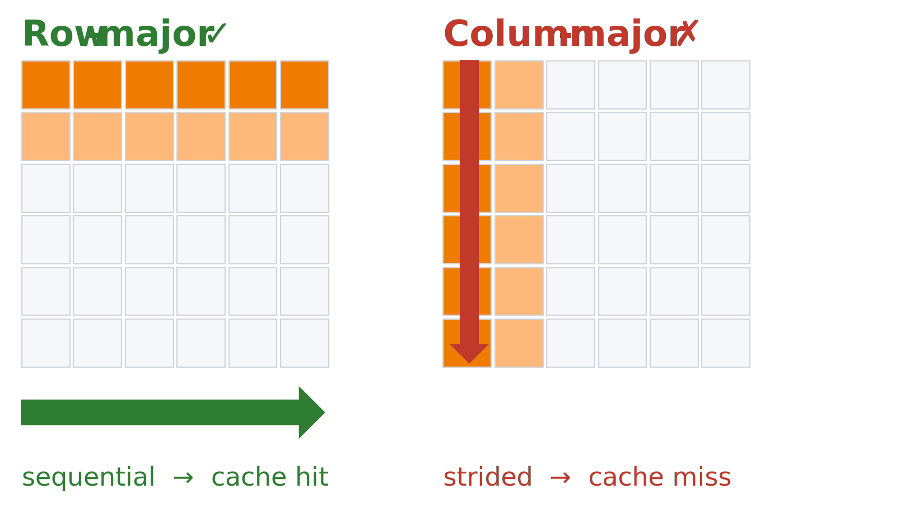
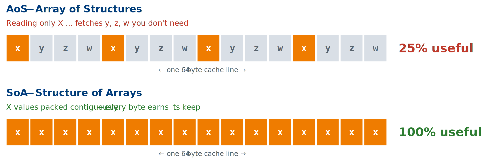
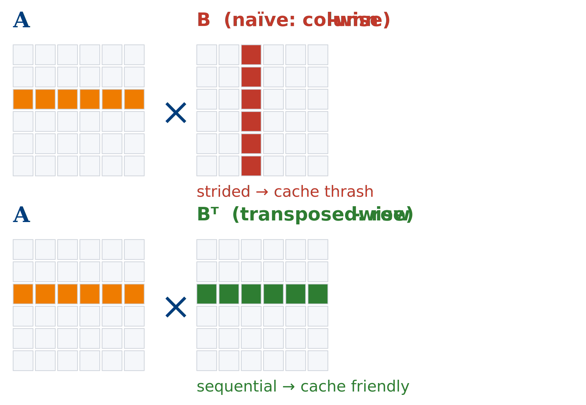
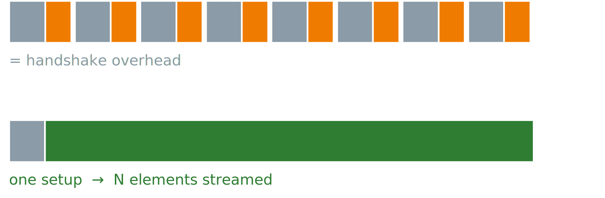

# Hardware Acceleration & Memory Access Examples

A reference for the code examples used to illustrate hardware acceleration concepts and memory access patterns. Each example is designed to build intuition for performance principles relevant to CPU, GPU, and FPGA platforms.

All examples are AI-generated. The repository is [here](https://github.com/NUS-EE4218/labs/tree/main/docs/General/Accel_Examples).

---

## 1. `col_row_maj_cache.c`

**Summary:** Allocates a 2D matrix and traverses it in both row-major and column-major order, timing each access pattern.

**Technical Significance:** Demonstrates the fundamental impact of spatial locality on CPU cache performance. Row-major traversal accesses memory sequentially (matching how C stores 2D arrays), resulting in high cache line utilisation. Column-major traversal strides across rows, causing frequent cache misses (only one useful word per fetch) and significantly higher latency. Directly analogous to DDR burst behaviour on FPGAs, where sequential AXI bursts are far more efficient than strided accesses.



**How to Run:**
```bash
gcc -O2 -o col_row_maj_cache col_row_maj_cache.c
./col_row_maj_cache
```
*Dependencies: standard C library (`time.h`). No external libraries required.*

---

## 2. `aos_vs_soa.c`

**Summary:** Compares two memory layout strategies — Array of Structures (AoS) and Structure of Arrays (SoA) — when summing a single field (x) across 64 million elements.

**Technical Significance:** When only one field of a multi-field struct is accessed, AoS wastes 75% of each cache line fetching unused fields (y, z, w). SoA packs the needed field contiguously, maximising cache line utilisation. This trade-off directly maps to BRAM layout decisions in HLS and FPGA data path design, where field-wise access patterns determine whether interleaved or separate memory banks are more efficient.



**How to Run:**
```bash
gcc -O2 -o aos_vs_soa aos_vs_soa.c
./aos_vs_soa
```
*Dependencies: standard C library. No external libraries required.*

---

## 3. `matrix_transpose_optimization.c`

**Summary:** Benchmarks naive matrix multiplication (column-wise access of B) against a version that pre-transposes B to enable sequential row access in the inner loop.

**Technical Significance:** The naive implementation accesses matrix B with a stride of N elements per step, defeating the cache on every inner-loop iteration. Pre-transposing B converts both operands to sequential row access, substantially improving cache hit rate. Demonstrates that a small amount of extra work (one transpose) can yield a large net gain — a principle that maps to BRAM bank partitioning and tiling strategies in HLS.

Cost: one extra O(N²) pass to transpose B.
Saved: O(N³) of cache misses in the inner loop.
This may sound counter-intuitive.

For FPGA, adding a reshape / tiling stage that costs area but unlocks a tight, pipelined inner dataflow.



**How to Run:**
```bash
gcc -O2 -o matrix_transpose matrix_transpose_optimization.c
./matrix_transpose
```
*Dependencies: standard C library. No external libraries required.*

---

## 4. `gpu_demo.c`

**Summary:** Uses OpenCL to run matrix multiplication (1024×1024) and element-wise vector multiplication (10M elements) on a GPU, comparing each against a CPU baseline.

**Technical Significance:** Illustrates the distinction between compute-bound and memory-bound workloads. Matrix multiplication (O(N³) arithmetic intensity) achieves large GPU speedups because the GPU's parallel compute units are kept busy. Element-wise vector multiplication (O(N) arithmetic intensity) offers far less speedup — memory bandwidth, not compute throughput, is the bottleneck regardless of parallelism. Establishes the concept of arithmetic intensity as the key predictor of GPU (and FPGA accelerator) benefit.

Arithmetic Intensity is the FLOPs per byte moved.

In compute-bound, each byte fetched is reused many times. Arithmetic intensity is high — the GPU's thousands of ALUs actually get fed.

In memory-bound, each element is used a limited number of times (usually once) — one multiply per load. PCIe transfer + AXI/ DRAM bandwidth dominate; ALUs sit idle.

**How to Run:**
```bash
gcc -O2 -o gpu_demo gpu_demo.c -lOpenCL
./gpu_demo
```
*Dependencies: OpenCL runtime and ICD loader (`libOpenCL`). Requires a GPU with an OpenCL 1.2+ driver. Install via `sudo apt install ocl-icd-opencl-dev` on Ubuntu.*

---

## 5. `coalesced_vs_non_coalesced.c`

**Summary:** Runs two OpenCL matrix multiplication kernels — one with coalesced global memory access and one with non-coalesced access — and reports kernel execution time for each.

**Technical Significance:** In GPU (and FPGA HBM/DDR) memory systems, coalesced access merges multiple work-item memory requests into a single wide transaction. The non-coalesced kernel accesses A and B with transposed indices, forcing individual narrow transactions and dramatically reducing effective bandwidth. Falls back to OpenMP CPU execution if no GPU is detected. Reinforces AXI burst vs. random-access behaviour familiar from FPGA design.

**How to Run:**
```bash
# With GPU
gcc -O2 -fopenmp -o coalesced coalesced_vs_non_coalesced.c -lOpenCL
./coalesced [matrix_size]   # default N=1024

# CPU-only fallback (no GPU required)
gcc -O2 -fopenmp -o coalesced coalesced_vs_non_coalesced.c
./coalesced
```
*Dependencies: OpenCL runtime (optional); OpenMP (included in GCC). Matrix size can be passed as a command-line argument.*

---

## 6. `vadd_comparison.cpp`

**Summary:** Defines two HLS-annotated vector addition kernels — a simple single-element version and a burst-optimised version with local ping-pong buffers — and benchmarks both in software simulation.

**Technical Significance:** The burst kernel stages data through local BRAM buffers in chunks of 64 elements, mimicking the read–compute–write pattern used in real HLS designs to achieve pipelined AXI burst transfers. The `#pragma HLS` directives (`m_axi`, `PIPELINE`, `ARRAY_PARTITION`) are present and syntactically valid for Vitis HLS, while the file also compiles as standard C++ for desktop simulation. Bridges the gap between algorithmic understanding and synthesisable FPGA code.



**How to Run:**
```bash
# Desktop simulation (CPU)
g++ -O2 -o vadd_comparison vadd_comparison.cpp
./vadd_comparison

# HLS synthesis (Vitis HLS)
# Add to a Vitis HLS project and run C Simulation or Synthesis
```
*Dependencies: Standard C++ library for desktop build. Vitis HLS (Xilinx/AMD) for synthesis and co-simulation.*

---

## 7. `sum_halves.cpp`

**Summary:** An HLS kernel that reads a 2048-element integer array from BRAM and writes 1024 outputs, each the average of a corresponding pair of elements from the two halves of the input array.

**Technical Significance:** A minimal but illustrative HLS design exercise. The `#pragma HLS PIPELINE` directive on the loop body targets an initiation interval of 1. The commented-out `ARRAY_PARTITION` pragma and the alternative three-way average invite students to explore how port conflicts on the BRAM interface limit pipeline throughput, and how array partitioning resolves them — a core HLS optimisation concept.

**How to Run:**
```bash
# HLS synthesis and C simulation (Vitis HLS)
# Add sum_halves.cpp to a Vitis HLS project, set top function to sum_halves, run C Sim

# Standalone CPU build (no HLS runtime needed)
g++ -O2 -o sum_halves sum_halves.cpp
```
*Dependencies: Vitis HLS for synthesis/co-sim. Compiles as plain C++ for functional verification.*

---

## 8. `report_adders.v` + `report_adders.ys`

**Summary:** A small Verilog module implementing three expressions — a constant-folded addition, a bitmask operation, and a multiply-by-two — paired with a Yosys synthesis script that runs the `synth` pass and reports adder/ALU cell counts.

**Technical Significance:** Demonstrates RTL-level synthesis analysis using the open-source Yosys toolchain. The three assignments exercise constant folding (`A + B` resolved at elaboration), bitwise masking (no adder generated), and shift-based multiplication (maps to a wire, not an adder). The `.ys` script shows how to filter the synthesis netlist with `stat -width t:$add t:$alu`, giving students a concrete method for auditing resource usage — directly applicable to understanding LUT/DSP budgets before mapping to an FPGA.

**How to Run:**
```bash
yosys -s report_adders.ys
```
*Dependencies: [Yosys](https://yosyshq.net/yosys/) — install via `sudo apt install yosys` on Ubuntu, or build from source. No FPGA toolchain required.*

---

## Quick Reference

| File | Platform | Key Concept |
|---|---|---|
| `col_row_maj_cache.c` | CPU | Cache line utilisation, spatial locality |
| `aos_vs_soa.c` | CPU | Memory layout, field access efficiency |
| `matrix_transpose_optimization.c` | CPU | Cache-friendly access via pre-transpose |
| `gpu_demo.c` | GPU (OpenCL) | Arithmetic intensity, compute- vs memory-bound |
| `coalesced_vs_non_coalesced.c` | GPU (OpenCL) | Memory coalescing, transaction width |
| `vadd_comparison.cpp` | CPU sim / HLS | AXI burst pattern, HLS pipeline pragmas |
| `sum_halves.cpp` | HLS | BRAM port conflicts, array partitioning |
| `report_adders.v` + `.ys` | Yosys (RTL) | Synthesis analysis, constant folding, cell reporting |