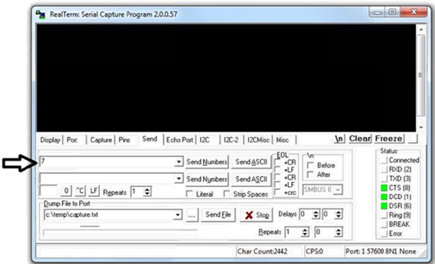
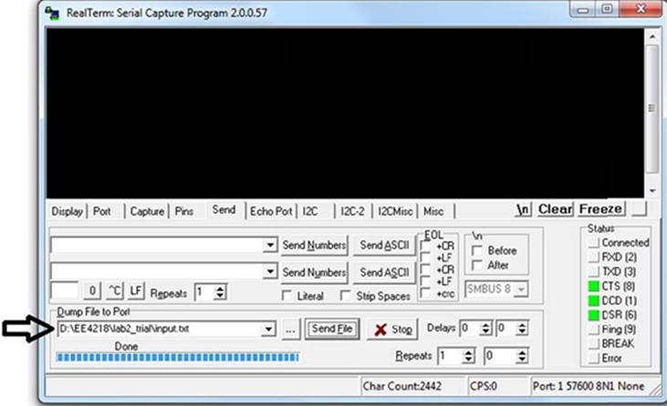
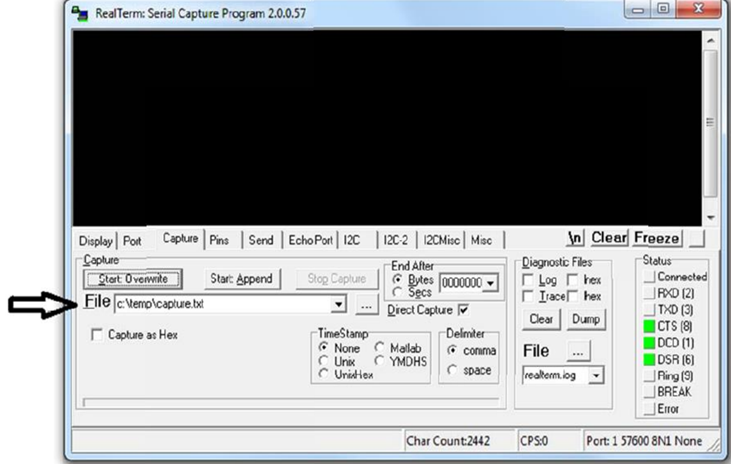

# Serial Console - RealTerm

Note: See the last tip in [Lab 2 : (main) Introduction to Hardware/Software Co-design](1_Intro) page for an important tip.

RealTerm is a terminal program specially designed for capturing and sending data through various protocols (UART, Raw TCP sockets etc). The purpose is similar to that of TeraTerm or PuTTY or GTKTerm or Serial Monitor (Arduino), but RealTerm is WAAY more feature-rich than any other serial console program.

The program can be downloaded from [https://realterm.i2cchip.com/Realterm\_3.0.1.44\_setup.exe](https://realterm.i2cchip.com/Realterm_3.0.1.44_setup.exe). Older versions are fine too. The newer versions have more options and look slightly different from the screenshots on this page.

If you are using FPGA locally, you need to configure the correct port and baud‐rate (**115200**) in RealTerm. This is shown in the figure below. Please ensure that **Change** is clicked after any port/speed modification.

The next step is to open the port. Click on **Open** to open the port. The status on the right should be green or gray, not red.

Note: Ensure that the port you are trying to connect to in RealTerm is not selected in Vitis.

## Few notes on the usage of RealTerm

Sending bytes using RealTerm: Click on the **Send** tab, type a number and click **Send Numbers/Send ASCII**. If you input, say 20 there and press Send Numbers, it will send 0x14. You can also enter directly as hexadecimal 0x14 and press Send Numbers.

If you enter 20 press Send ASCII, it will send two characters 0x32 and 0x30. If you enter 0x14 and press Send ASCII, it will send 4 characters 0x30, 0x78, 0x31, 0x34 ").

You can also use escape sequences (special characters) such as \\r, \\n etc.

Sending text file contents using RealTerm: Specify the file in the **Dump File to Port** and click **Send File**.

Capturing data into a file using RealTerm: Click on **Capture** tab and specify the file where you want the output to be saved. Click on **Start Overwrite**.  Check the **Display** option (available only in the newer versions) if you wish to see the data that is getting captured.

**Explore the various features of RealTerm** and be familiar with it.

The data can be displayed in a number of different formats, selectable from the Display tab.

You can also click on the black part of the screen to send what you type, similar to how it is in TeraTerm/PuTTY etc. You can enable 'Half Duplex' in the Display tab if you like to see what you send out in a different color (green). The received data will be in yellow color.

You can enable newLine mode if you wish the incoming formatting characters such as \\n to work as intended, instead of simply displaying it - RealTerm displays \\n as lf (linefeed) and \\r as cr (carriage return).
