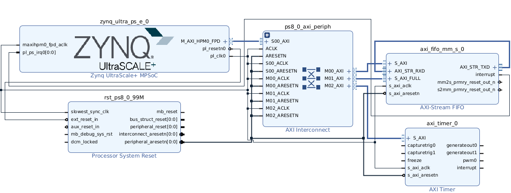
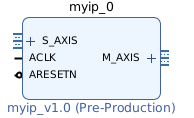
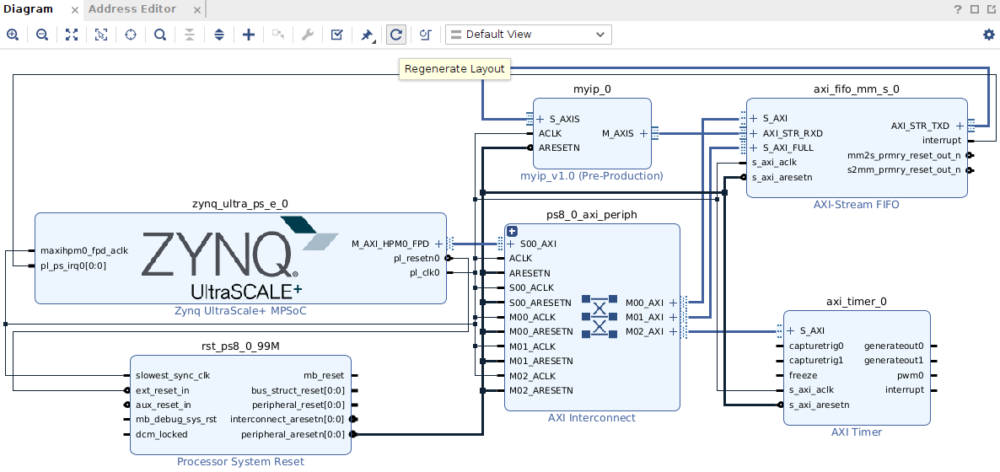

# Coprocessor Integration using AXI Stream FIFO
You can read more about AXI Stream FIFO at <https://www.xilinx.com/support/documentation/ip_documentation/axi_fifo_mm_s/v4_1/pg080-axi-fifo-mm-s.pdf> (please do!)

When we use AXI Stream FIFO as the bridge, the processor reads the operands from the memory (RAM) and writes them to the transmit FIFO in AXI Stream FIFO peripheral via AXI (not AXI Stream), which in turn passes it to the coprocessor via AXI Stream. The result returned by the coprocessor gets deposited into a receive FIFO in AXI Stream FIFO peripheral, from which the processor reads it via AXI (not AXI Stream) and writes it to the memory (RAM).

This manual assumes that we are using the custom IP created using the coprocessor template given for Lab 1 for adding 4 numbers. It has two AXIS interfaces - S_AXIS for sending data, and M_AXIS for receiving data. Even if the coprocessor functionality is different, the interface is still the same, and hence the procedure below applies.

Let us assume you are starting with your Lab 2 Vivado project as shown below, with the AXI Stream FIFO peripheral already included. If not, include AXI Stream FIFO following the instructions in Lab 2. Also, note that the connection from the interrupt of axi_fifo_mm_s_0 to pl_ps_irq0 of zynq_ultra_ps_e_0 is optional, only if you want to use interrupts.

The following instructions also assume that the coprocessor is already added/available in the IP Integrator canvas. If not, add it from the IP Catalog.

Now, make/modify the following connections.

Delete the connection from axi_fifo_mm_s_0/AXI_STR_TXD to axi_fifo_mm_s_0/AXI_STR_RXD

Connect myip_0/M_AXIS <-> axi_fifo_mm_s_0/AXI_STR_RXD

Connect myip_0/S_AXIS <-> axi_fifo_mm_s_0/AXI_STR_TXD

You can now run the connection automation that will connect the ACLK and ARESETN of myip_0 :

myip_0/ACLK <-> zynq_ultra_ps_e_0/pl_clk0

myip_0/ARESETN <-> rst_ps8_0_99M/peripheral_aresetn

You can click regenerate layout to tidy up.

 

You can now save the block design (Ctrl+S) and generate bitstream.

The rest of it is similar to Lab 2.

You need to export hardware including bitstream.

Open Vitis Classic > create a new workspace (using the previous one is also ok) > create a new platform project using the new .xsa file (upgrading the previous one is ok too), > create an application project.

The application project (say, Hello World) main file contents should be replaced by test_fifo_myip_v1_0.c to test the coprocessor for adding numbers. Note the close parallel it has with tb_myip_v1_0.v/vhd. You can make appropriate changes to this file to deal with different input and output sizes if your coprocessor functionality is different. 

Now, create a run configuration, open the serial console program (e.g., RealTerm), and run.

If you wish to use interrupts, you need to make sure that there is a connection from the interrupt of axi_fifo_mm_s_0 to pl_ps_irq0 of zynq_ultra_ps_e_0. There is a built-in example program for axi_fifo_mm_s using interrupts, which can be combined appropriately with test_fifo_myip_v1_0.c to have interrupt-based communication. However, note that interrupts are useful only if the processor is doing some other meaningful work while the coprocessor is doing computations.