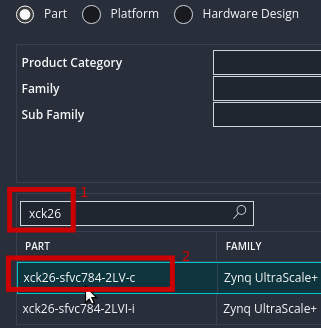
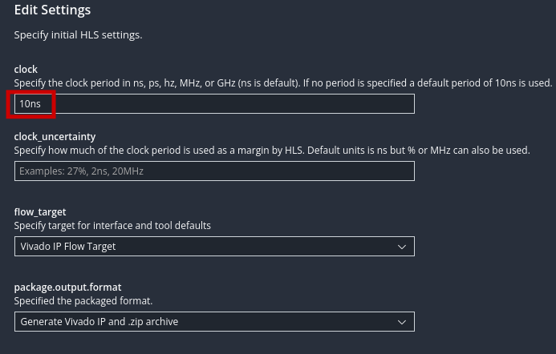
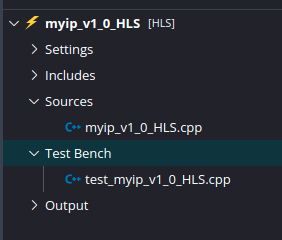
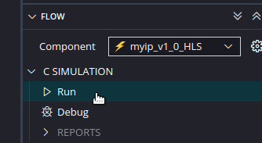
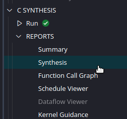
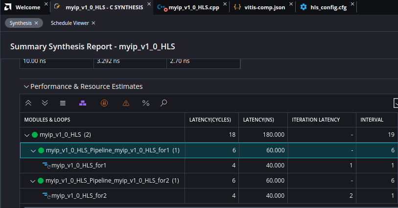
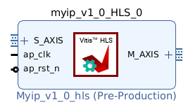
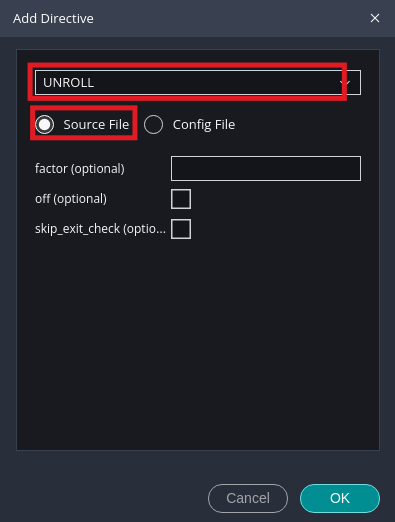
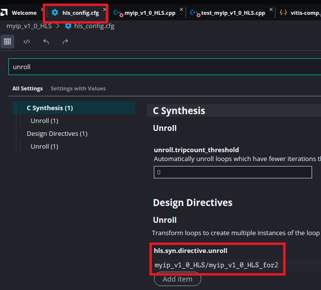

# HLS Flow

## Introduction

The following manual is for Vitis (Visual Studio Code based) unified IDE. The spirit of the instructions is quite similar for Vitis HLS (eclipse-based, which is being deprecated), if you wish to use that.

You will need the template files myip_v1_0_HLS.cpp (CPP source for HLS) and test_myip_v1_0_HLS.cpp (Testbench). As with the Lab 1 HDL template, the sample program receives 4 numbers, computes the sum, and sends back 4 numbers which are sum, sum+1, sum+2, and sum+3. Read through these files and understand the implementation. You will notice that test_myip_v1_0_HLS.cpp is very similar to the other test programs that we have used. Have a good look at the similarities and differences.

test_myip_v1_0_HLS.cpp is a testbench used for simulation only. It is not executed on the ARM Cortex A53 processor on the board. We will be doing 2 types of simulation.

- C simulation.
  - C simulation executes a pure software version of the files, where myip_v1_0_HLS.cpp simply contains the function myip_v1_0_HLS() that is called by the main program in test_myip_v1_0_HLS.cpp. This is a very fast process, used to check the algorithmic correctness.
- RTL/C Cosimulation

  - Here, instead of calling myip_v1_0_HLS() as a function, the corresponding RTL (=HDL) code generated through C Synthesis (=HLS) is simulated using the Vivado simulator (XSIM) behind the screens. This takes more time than C simulation (orders of magnitude more time for complex designs) and is used to test the functional correctness of the HDL generated by the HLS process. The test_myip_v1_0_HLS.cpp feeds data directly into the (simulated) S_AXIS of the coprocessor, and gets data directly from the (simulated) M_AXIS of the co-processor. AXI bus and AXI Stream FIFO are not involved.

test_fifo_myip_v1_0.c. is executed on the ARM Cortex A53 processor of the board, and exchanges data with the real coprocessor through the AXI Stream FIFO. As the coprocessor created using HLS is a drop-in replacement for the coprocessor packaged in lab 3, the same test_fifo_myip_v1_0.c can be used.

## Creating and Synthesizing a Design

Open Vitis.

Select Open Workspace. Select a freshly created folder (create a folder using your operating system's file manager, e.g., explorer) for the HLS IP. If you are opening an existing design, you can also select it under Recent Workspaces.

Select Create HLS Component. Specify a name (myip_v1_0_HLS) and path/location that doesn't involve underscores or spaces. Next.

Accept the defaults for the Configuration File and click Next.

In the Add Source Files dialog, add the design file (myip_v1_0_HLS.cpp), testbench (test_myip_v1_0_HLS.cpp), and the top function.

It may take a few seconds after you click Browse in step 3 above before the top function myip_v1_0_HLS appears as an option. Select it and click ok.

Note that the above files will remain in their original location and won't get copied over to the project, there is no option to easily copy it over to the project. The files should be in a location that doesn't involve underscores or spaces. Next.

In the part number selection, search for xck26 and select xck26-sfvc784-2LV-c (which is the part number for the chip used on board). Next.

Note: You may also be able to find it easily under Boards > Kria KV260 Vision AI Starter Kit in Vitis HLS, but not in Vitis.

Enter 10ns or 100MHz, without a space between the quantity and the unit. Make sure that the rest of the settings are as below, which should be the case by default. Next.

Next. Finish.

You will see myip_v1_0_HLS.cpp file under myip_v1_0_HLS>Sources, and test_myip_v1_0_HLS.cpp under Test Bench in the workspace. Ensure that the contents are as expected. Later on, you need to modify these files as appropriate to implement assignment 4.

You can see all the settings under myip_v1_0_HLS>Settings > hls_config.cfg.

Under FLOW, Run C SIMULATION. This tests your program as standard software - an executable is created and run.

You can see that it completes successfully in the output console of VS Code (Vitis).

Now, run C SYNTHESIS. Once done, you can see the success message in the output console.

You can now explore the various reports under C SYNTHESIS > REPORTS.

Of particular interest are

- Synthesis > Timing Estimate, Performance & Resource Estimates.
- Schedule viewer (the result of the scheduling step in architectural synthesis, screenshot not shown here).

You can also see the HDL files generated by the HLS tools under myip_v1_0_HLS>Output folder in the workspace.

Now, run C/RTL COSIMULATION. Once done, you can see the success message in the output console.

This runs the HDL (RTL) code using the Vivado (XSIM) simulator, using the stimulus provided by the C testbench. You can see the success message in the output console.

Finally, run PACKAGE. Once done, you can see the success message in the output console. The IP is now ready to be used in the Vivado project.

Open Vivado. Create / Open a project (you can use a copy of the Lab 3 project). Add your Vitis workspace to the IP repository.

That is it. Now you will be able to see the IP in the IP catalog.

You can use the IP just like the AXIS IP you created in Lab 3. It is a drop-in replacement. You can delete the Lab 3 IP, and make the S_AXIS and M_AXIS connections to AXI Stream FIFO / AXI DMA. Clock and reset can be connected via connection automation.

The rest of the process is standard - create HDL wrapper (if not set to auto-update) > Generate Bitstream> Export Hardware (including bitstream). The rest is in Vitis Classic. The exact same Vitis Classic project can be used (including all the source files), with the .xsa file refreshed to account for the new HLS IP instead of the HDL IP of Lab 3.

## Optimizing the Design

This section details how you can control the hardware / architecture generated using directives. These directives can be inserted as #pragma in your C-code, or graphically as shown below.

Open the HLS Directive view on the right. Note that the directive view as shown below will appear only when the myip_v1_0_HLS.cpp is selected in the editor window. You can see that some directives that were in the template code, such as the HLS INTERFACE directive appear in the list of directives.

Select the part of the code whose hardware architecture you wish to control, for example, the for loop *myip_v1_0_HLS_for1* below. We already had a label myip_v1_0_HLS_for1 for the for loop in our source code for easy identification but is not mandatory*.

Select the directive. Here, we UNROLL the for loop selected above. You can also set the optional parameters, such as the unroll factor for UNROLL. You can choose whether the directive is to be inserted into the code as a #pragma, or to be inserted into the config file. We choose the former for now.

You can now see the directive in the source code.

*A label is necessary if we are inserting the directive into the config file. If you choose to insert the directive into the config file, you can see it as follows.

Run C Synthesis again. You can see that the timing, performance (latency) & resource (FF, LUT, etc) estimates have changed.

Try separately with arbitrary precision and 32-bit precision by commenting/uncommenting the relevant lines in myip_v1_0_HLS.cpp. Do you notice a difference in timing, performance & resource estimates once you run C synthesis?
